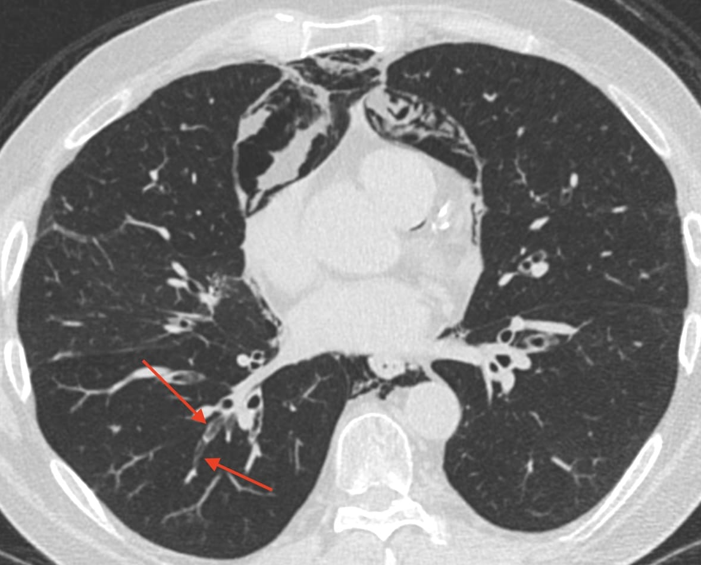

```{r setup, include = FALSE}
options(htmltools.dir.version = FALSE)
library(knitr)
library(metathis)
library(xaringanExtra)
library(showtext)
library(kableExtra)
library(icons)
opts_chunk$set(echo=FALSE)

# set engines
knitr::knit_engines$set("markdown")

xaringanExtra::use_panelset()
# xaringanExtra::use_share_again()
xaringanExtra::use_tile_view()

```

```{r xaringan-themer, include=FALSE, warning=FALSE}
library(xaringanthemer) 
style_mono_light(base_color = "#23395b")
```

```{r meta, echo=FALSE}
meta() %>%
  meta_general(
    description = "A thoracic case conference",
  ) %>% 
  meta_name("github-repo" = "howardm") %>% 
  meta_social(
    title = "Case Conference",
    url = "https://howardm.github.io/CaseConferenceDecember7th2021",
    image = "http://howardmann.us/twitter-card2.jpg",
    image_alt = "",
    og_type = "website",
    og_author = "Howard Mann",
    twitter_card_type = "summary_large_image",
    twitter_creator = "@howardm19"
  )
```  


class: inverse, center, middle

### Thoracic Case Conference - Lung and Stem Cell Transplantation

### *The usual and extraordinary*


### .blue[Howard Mann, M.D.]


```{r icon-style}
icon_style(fontawesome("link"), scale = 1, fill = "white")
```
howardmann.us


```{r icon-stylex}
icon_style(fontawesome("paper-plane"), scale = 1, fill = "white")
```

### December 7th, 2021


---
class: center, middle


<!----------------------------- SLIDE BREAK ----------------------------->

---

layout: true

background-image: url(images/circle-cropped.png)
background-position: 98% 1%
background-size: 4%

---

class: middle

.big[.blue[Introduction]

These cases exemplify the variety of imaging findings and transplantation-related complications one may encounter after lung and stem cell transplantation.

Some are imaging findings without clinical consequence; other represent life-threatening complications.] 


<!----------------------------- SLIDE BREAK ----------------------------->
---


class: inverse
name: case1

.blue[Case 1]

.panelset[

.panel[.panel-name[Clinical Presentation]

.big[Bilateral lung transplanation for *idiopathic pulmonary arterial hypertension*]

] <!--end of panel-->

.panel[.panel-name[Imaging I]

.blue[First two days after transplantation]

.pull-left[

]

.pull-right[

]

] <!--end of panel-->


.panel[.panel-name[Imaging II]

.blue[Succeeding days after transplantation]

Questions: What management was instituted ? What was the outcome of the complication ?

.pull-left[

]

.pull-right[


]

] <!--end of panel-->


] <!--end of panelset-->


<!----------------------------- SLIDE BREAK ----------------------------->

---

class: inverse
name: case2

.blue[Case 2]

.panelset[

.panel[.panel-name[Clinical Presentation]

This patient underwent allogeneic stem cell transplantation one year before for a lymphoproliferative disorder

] <!--end of panel-->

.panel[.panel-name[Imaging]

.pull-left[

<div style="text-align:center;">
<iframe class="pacsbin"
         id="case2"
         src="https://www.pacsbin.com/c/WknqHlnQjw?s=61abd6d6a093905a97ced39f&i=61abd6d6a093905a97ced3a0&ww=1279&wc=-482&an=false&header=false&notes=false&overlay=false" 
         style="width: 500px; height: 500px; border: 0;"></iframe>
</div>


]

.pull-right[

Representative images from an Expiration Series

<br><br>

.pull-left[]

.pull-right[]

]


] <!--end of panel-->


] <!--end of panelset-->


<!----------------------------- SLIDE BREAK ----------------------------->

---

class: inverse
name: case3

.blue[Case 3]

.panelset[

.panel[.panel-name[Clinical Presentation]

Acute respiratory failure one week after transplantation.

AFB and GMS stains of bronchial lavage fluid did not reveal organisms.

Pre- and post-transplantation CBCs revealed mild eosinophilia. 

] <!--end of panel-->

.panel[.panel-name[Imaging]

<br>

.pull-left[]


.pull-right[

<br>

]


] <!--end of panel-->


] <!--end of panelset-->


<!----------------------------- SLIDE BREAK ----------------------------->

---

class: inverse
name: case4

.blue[Case 4]


.panelset[

.panel[.panel-name[Clinical Presentation]

Chest Radiography after lung transplantation. (The Edwards Sapien aortic valve device was placed previously.) Two complications developed. 

] <!--end of panel-->

.panel[.panel-name[Imaging I]

.pull-left[

]

.pull-right[


]


] <!--end of panel-->

.panel[.panel-name[Imaging II]

.pull-left[


]


.pull-right[


]

] <!--end of panel-->

] <!--end of panelset-->


<!----------------------------- SLIDE BREAK ----------------------------->

---

class: inverse
name: case5

.blue[Case 5]

.panelset[

.panel[.panel-name[Clinical Presentation]

Fever evaluation  4 months after stem cell transplantation

] <!--end of panel-->

.panel[.panel-name[Imaging]

.pull-left[


]


.pull-right[


]


] <!--end of panel-->


] <!--end of panelset-->


<!----------------------------- SLIDE BREAK ----------------------------->

---

class: inverse
name: case6

.blue[Case 6]

.panelset[

.panel[.panel-name[Clinical Presentation]

Imaging six months after single right lung transplantation (diffuse left lung fibrosis).

] <!--end of panel-->

.panel[.panel-name[Imaging]

<div style="text-align:center;">
<iframe class="pacsbin"
         id="case6"
         src="https://www.pacsbin.com/c/-JwJGDAQov?s=61ac15baa093905a97cee0a3&i=61ac15baa093905a97cee12b&ww=1500&wc=-500&an=false&header=false&notes=false&overlay=false" 
         style="width: 500px; height: 500px; border: 0;"></iframe>
</div>

] <!--end of panel-->


] <!--end of panelset-->


<!----------------------------- SLIDE BREAK ----------------------------->

---

class: inverse
name: case7

.blue[Case 7]

.panelset[

.panel[.panel-name[Clinical Presentation]

This patient had stem cell transplanation 18 months previously. Over time, clinical and spirometric findings of the *bronchiolitis obliterans syndrome* have developed.

Corresponding CT findings (mosaic attenuation and airway disease) are present as shown below.

.pull-left[


]

.pull-right[


]


In an August, he presented with acute chest discomfort and slightly increased shortness of breath.

] <!--end of panel-->

.panel[.panel-name[Radiography at time of symptoms]

.pull-left[


]

.pull-right[


]


] <!--end of panel-->

.panel[.panel-name[Concurrent CT]

.center[]

] <!--end of panel-->


] <!--end of panelset-->


<!----------------------------- SLIDE BREAK ----------------------------->

---

class: inverse
name: case8

.blue[Case 8]

.panelset[

.panel[.panel-name[Clinical Presentation]

Unexplained persistent hypoxia several days after bilateral lung transplantation.

] <!--end of panel-->

.panel[.panel-name[Radiography]

.center[]

] <!--end of panel-->

.panel[.panel-name[CT]

.pull-left[

A difficult case.

````mardown
Evaluate vascular & airway anatomy carefully!
````
]

.pull-right[

<div style="text-align:center;">
<iframe class="pacsbin"
         id="case8"
         src="https://www.pacsbin.com/c/bJSFPb1NjP?s=61ac261aa093905a97cee337&i=61ac261aa093905a97cee367&ww=529&wc=101&an=false&header=false&notes=false&overlay=false" 
         style="width: 500px; height: 500px; border: 0;"></iframe>
</div>
]

] <!--end of panel-->

] <!--end of panelset-->


<!----------------------------- SLIDE BREAK ----------------------------->

---

class: inverse
name: case9

.blue[Case 9]

.panelset[

.panel[.panel-name[Clinical Presentation]

History: Lung transplantation

] <!--end of panel-->

.panel[.panel-name[Imaging]

.pull-left[


]

.pull-right[


]

] <!--end of panel-->


] <!--end of panelset-->


<!----------------------------- SLIDE BREAK ----------------------------->

---

class: inverse
name: case10

.blue[Case 10]

.panelset[

.panel[.panel-name[Clinical Presentation]

8 months after stem cell transplantation for relapsed CLL. A lesion was aspirated under CT guidance.

] <!--end of panel-->

.panel[.panel-name[Imaging ]

.pull-left[


]

.pull-right[


]

] <!--end of panel-->


] <!--end of panelset-->


<!----------------------------- SLIDE BREAK ----------------------------->

---

class: inverse
name: case11

.blue[Case 11]

.panelset[

.panel[.panel-name[Clinical Presentation]

A respiratory illness 9 months after stem cell transplantation. A course of treatment was employed.

] <!--end of panel-->

.panel[.panel-name[Imaging I ]

.pull-left[


]

.pull-right[


]


] <!--end of panel-->

.panel[.panel-name[Imaging II ]

.pull-left[


]

.pull-right[


]


] <!--end of panel-->

] <!--end of panelset-->


<!----------------------------- SLIDE BREAK ----------------------------->

---
class: inverse
name: case12

.blue[Case 12]


.panelset[

.panel[.panel-name[Clinical Presentation]

Unilateral left lung transplantation

] <!--end of panel-->

.panel[.panel-name[Imaging]

<div style="text-align:center;">
<iframe class="pacsbin"
         id="case6"
         src="https://www.pacsbin.com/c/-k9h5ZOVjv?s=61ad0d84a093905a97cf4f12&i=61ad0d84a093905a97cf4f13&ww=925&wc=260&an=false&header=false&notes=false&overlay=false" 
         style="width: 500px; height: 500px; border: 0;"></iframe>
</div>


] <!--end of panel-->


] <!--end of panelset-->


<!----------------------------- SLIDE BREAK ----------------------------->

---

class: inverse
name: case13

.blue[Case 13]


.panelset[

.panel[.panel-name[Clinical Presentation]

This patient has undergone lung transplanation. He is asymptomatic.

] <!--end of panel-->

.panel[.panel-name[Imaging I ]

.pull-left[


]

.pull-right[


]


] <!--end of panel-->

.panel[.panel-name[Imaging II ]

.pull-left[


]

.pull-right[


]


] <!--end of panel-->

] <!--end of panelset-->


<!----------------------------- SLIDE BREAK ----------------------------->

---

class: inverse
name: case14

.blue[Case 14]


.panelset[

.panel[.panel-name[Clinical Presentation]

Imaging after lung transplantation

] <!--end of panel-->

.panel[.panel-name[Imaging ]

<br>
.pull-left[


]

.pull-right[


]

] <!--end of panel-->


] <!--end of panelset-->


<!----------------------------- SLIDE BREAK ----------------------------->

---

class: inverse
name: case15

.blue[Case 15]


.panelset[

.panel[.panel-name[Clinical Presentation]

Imaging after lung transplantation. Measured FVC diminished between the two examinations.

] <!--end of panel-->

.panel[.panel-name[Imaging ]

.pull-left[


]

.pull-right[


]


] <!--end of panel-->


] <!--end of panelset-->


<!----------------------------- SLIDE BREAK ----------------------------->


<!----------------------------- SLIDE BREAK ----------------------------->
```{css echo=FALSE}
.highlight-last-item > ul > li, 
.highlight-last-item > ol > li {
  opacity: 0.2;
}
.highlight-last-item > ul > li:last-of-type,
.highlight-last-item > ol > li:last-of-type {
  opacity: 1;
}
```
  
